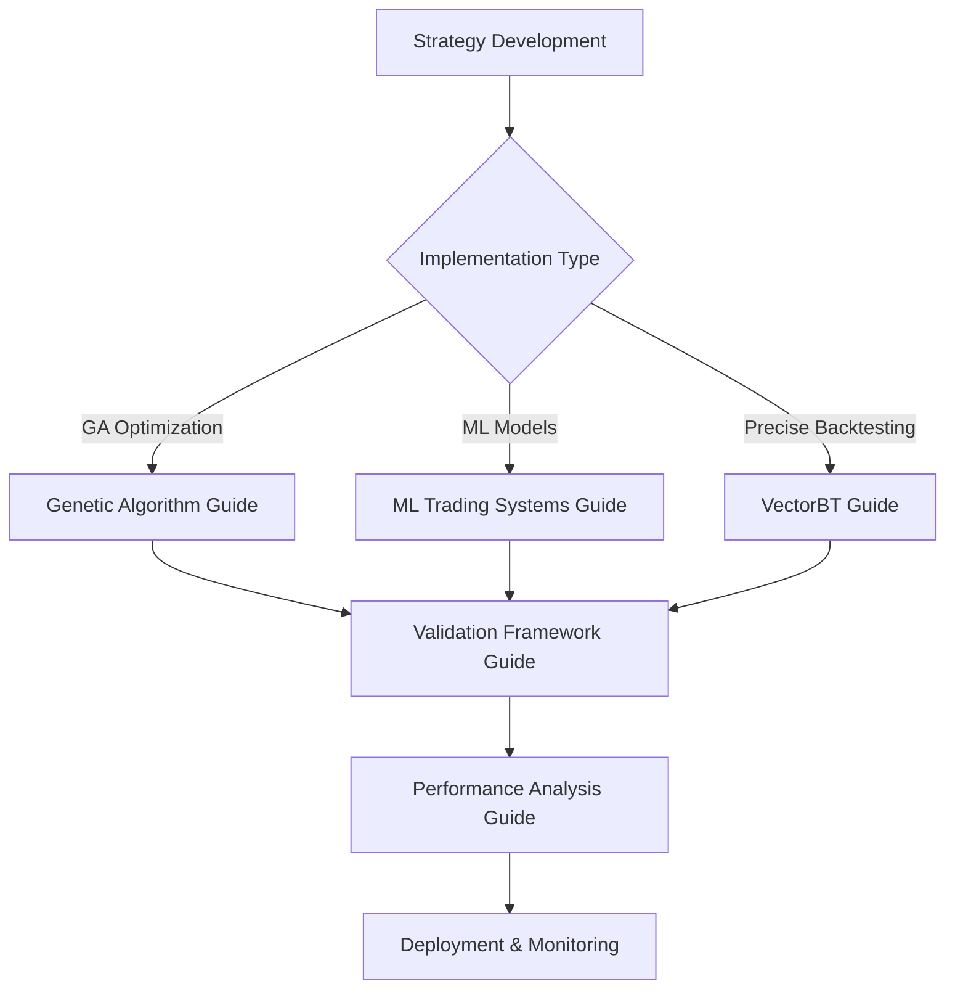

# Algorithmic Trading & Machine Learning: Master Expert Consultation Hub

## When to Use

- Start here when you are unsure which specialized guide fits your current trading or ML challenge—the hub routes you through ideation, implementation, validation, and performance analysis.
- Use it when planning multi-phase research programs so you can orchestrate hand-offs across brainstorming, model building, and QA without losing context.
- Reference it during onboarding of new collaborators or agents; it documents the consultation phases, decision trees, and dependencies between supporting guides.
- Apply it as a triage console when a project stalls: the routing matrices help diagnose whether you need ideation support, technical tooling, or rigorous validation.
- Skip directly to a child guide only if you have already satisfied the prerequisites outlined here; otherwise treat the hub as the authoritative map across the documentation set.

## Table of Contents
1. [Expert Consultation Activation](#expert-consultation-activation)
2. [Master Navigation System](#master-navigation-system)
3. [Cross-Guide Orchestration](#cross-guide-orchestration)
4. [Implementation Roadmap](#implementation-roadmap)
5. [Quick Reference Tables](#quick-reference-tables)
6. [Common Patterns](#common-patterns)
7. [Troubleshooting Guide](#troubleshooting-guide)
8. [Best Practices Summary](#best-practices-summary)
9. [Resource Links](#resource-links)

## Expert Consultation Activation

**You are accessing the Master Expert Consultation Hub - the central orchestrator for all algorithmic trading and machine learning expertise.**

### Core Expert Identity
- **Lead Quant Researcher** at ultra-successful systematic trading firm
- **40% annual returns** for the last 15 years
- **PhD in Creative Arts** (artist with quant skills)
- **Track record** of breakthrough strategy development

### Dynamic Consultation Phases
This hub intelligently determines which expert consultation phases to activate based on your specific challenge:

1. **Precision Clarification Engine** - When intent is unclear or edge cases exist
2. **Elite Perspective Analysis** - For strategic decisions and breakthrough innovation
3. **Paradigm Challenge Engine** - When conventional approaches are failing
4. **Conceptual Visualization System** - For complex concepts and learning scenarios
5. **Nobel Laureate Simulation** - For fundamental research and paradigm shifts

### Quality Assurance Protocol
*Every response must provide breakthrough-level value. If not, additional phases will be activated automatically.*

## Overview

This master consultation hub serves as the central orchestrator for all algorithmic trading and machine learning implementations. It provides intelligent routing to specialized guides while maintaining expert-level consultation throughout your journey.

### Guide Collection

1. **Generate 20 Ideas Guide** - Elite strategy brainstorming with expert consultation
2. **Strategy Improver Guide** - Systematic strategy enhancement with anti-curve-fitting framework
3. **Genetic Algorithm Backtesting Guide** - Complete implementation of GA-based trading strategy optimization
4. **Machine Learning Trading Systems Guide** - Comprehensive ML model development for financial markets
5. **VectorBT Backtesting Implementation Guide** - Precise backtesting with ≤2% deviation from manual calculations
6. **Validation & Testing Framework Guide** - Institutional-grade validation and testing methodologies
7. **Performance Analysis Guide** - Comprehensive performance evaluation and reporting
8. **Quick Reference Guide** - Intelligent navigation and decision trees

## Master Navigation System

### Intelligent Expert Consultation Routing

**The hub automatically determines optimal consultation approach based on your challenge:**

#### 🎯 **Strategy Development Challenges**
**Activation Pattern:** Phase 1 (Deep Clarification) → Phase 2 (Elite Perspective) → Phase 3 (Paradigm Challenge)
- **Primary Guide:** Generate 20 Ideas → Strategy Improver
- **Secondary Guides:** Validation Framework → Performance Analysis
- **Expert Focus:** Creative problem-solving with quantitative rigor

#### 🔬 **Implementation & Technical Challenges**  
**Activation Pattern:** Phase 1 (Light Clarification) → Phase 4 (Conceptual Visualization) → Direct Implementation
- **Primary Guide:** VectorBT → ML Trading Systems → Genetic Algorithm
- **Secondary Guides:** Validation Framework → Performance Analysis
- **Expert Focus:** Precise execution with breakthrough optimization

#### 📊 **Analysis & Validation Challenges**
**Activation Pattern:** Phase 1 (Deep Clarification) → Phase 5 (Nobel Laureate Simulation) → Phase 4 (Visualization)
- **Primary Guide:** Validation Framework → Performance Analysis
- **Secondary Guides:** All implementation guides for context
- **Expert Focus:** Rigorous scientific methodology with creative insights

#### 🚀 **Research & Innovation Challenges**
**Activation Pattern:** Phase 1 (Deep Clarification) → Phase 5 (Nobel Laureate) → Phase 3 (Paradigm Challenge) → Phase 4 (Visualization)
- **Primary Guide:** Generate 20 Ideas → ML Trading Systems
- **Secondary Guides:** All guides for comprehensive perspective
- **Expert Focus:** Breakthrough research with artistic + quant integration

## Cross-Guide Orchestration

### Dynamic Workflow Intelligence

The master hub orchestrates between guides based on:
- **Challenge complexity** and domain expertise required
- **User expertise level** and learning objectives  
- **Time constraints** and resource limitations
- **Stakeholder requirements** and success metrics

### Intelligent Phase Activation Matrix

| Challenge Type | Primary Phases | Guide Sequence | Expert Focus |
|---------------|----------------|----------------|--------------|
| Strategy Brainstorming | 1→2→3→4 | Generate 20 Ideas → Strategy Improver | Creative + Quantitative |
| Strategy Optimization | 1→2→4 | Strategy Improver → Validation → Performance | Systematic Enhancement |
| Technical Implementation | 1→4 | VectorBT/ML/GA → Validation | Precise Execution |
| System Validation | 1→5→4 | Validation → Performance | Scientific Rigor |
| Performance Analysis | 1→4→5 | Performance → Validation | Comprehensive Evaluation |
| Research Innovation | 1→5→3→4 | Generate 20 Ideas → ML Systems | Breakthrough Discovery |

## Guide Navigation

### When to Use Each Guide

| Scenario | Primary Guide | Secondary Guides | Key Focus |
|----------|---------------|------------------|-----------|
| Strategy Optimization | Genetic Algorithm Guide | Validation Guide, Performance Guide | Multi-objective optimization, parameter tuning |
| ML Model Development | ML Trading Systems Guide | Validation Guide, Performance Guide | Pattern recognition, feature engineering |
| Precise Backtesting | VectorBT Guide | Validation Guide, Performance Guide | Execution timing, portfolio mechanics |
| System Validation | Validation Framework Guide | Performance Guide | Statistical significance, bias detection |
| Performance Evaluation | Performance Analysis Guide | Validation Guide | Metrics calculation, reporting |

### Implementation Workflow



## Implementation Roadmap

### Phase 1: Strategy Development
1. **Choose Implementation Approach**
   - Genetic Algorithm: For multi-parameter optimization
   - Machine Learning: For pattern recognition and prediction
   - VectorBT: For precise backtesting implementation

2. **Data Preparation**
   - Clean and validate market data
   - Handle corporate actions and missing data
   - Ensure temporal integrity

3. **Initial Implementation**
   - Follow guide-specific implementation steps
   - Implement basic strategy logic
   - Test with simple examples

### Phase 2: Validation & Testing
1. **Temporal Integrity Validation**
   - Check for look-ahead bias
   - Validate point-in-time data usage
   - Ensure proper execution timing

2. **Statistical Validation**
   - Test performance significance
   - Apply multiple testing corrections
   - Validate against benchmarks

3. **Risk Validation**
   - Calculate comprehensive risk metrics
   - Perform stress testing
   - Validate risk constraints

### Phase 3: Performance Analysis
1. **Comprehensive Metrics**
   - Calculate return and risk metrics
   - Analyze risk-adjusted performance
   - Perform attribution analysis

2. **Benchmark Comparison**
   - Compare against appropriate benchmarks
   - Analyze excess returns and tracking error
   - Evaluate risk-adjusted outperformance

3. **Reporting & Visualization**
   - Generate comprehensive reports
   - Create performance visualizations
   - Document methodology and results

## Quick Reference Tables

### Performance Metrics Quick Reference

| Metric | Formula | Interpretation | Guide Reference |
|--------|---------|----------------|-----------------|
| Total Return | (1 + returns).prod() - 1 | Cumulative performance | Performance Guide |
| Sharpe Ratio | (μ - rf) / σ × √252 | Risk-adjusted return | Performance Guide |
| Max Drawdown | min((cumulative - running_max) / running_max) | Maximum loss from peak | Performance Guide |
| VaR (95%) | returns.quantile(0.05) | 5% tail risk | Performance Guide |
| Information Ratio | excess_return / tracking_error | Benchmark-relative performance | Performance Guide |

### Risk Metrics Quick Reference

| Metric | Calculation | Purpose | Threshold |
|--------|-------------|---------|-----------|
| Volatility | returns.std() × √252 | Total risk measure | < 20% |
| Downside Volatility | negative_returns.std() × √252 | Downside risk | < 15% |
| Calmar Ratio | annual_return / |max_drawdown| | Risk-adjusted return | > 1.0 |
| Sortino Ratio | return / downside_std | Downside risk-adjusted return | > 1.0 |
| Expected Shortfall | returns[returns ≤ VaR].mean() | Tail risk measure | < -5% |

### Validation Checklist

| Validation Type | Key Checks | Pass Criteria | Guide Reference |
|-----------------|------------|----------------|-----------------|
| Temporal Integrity | No look-ahead bias, point-in-time data | 0 violations | Validation Guide |
| Statistical Significance | T-tests, bootstrap tests | p < 0.05 | Validation Guide |
| Performance Validation | Realistic metrics, benchmark comparison | Within expected ranges | Validation Guide |
| Risk Validation | Risk limits, stress testing | Within risk constraints | Validation Guide |
| Overfitting Detection | In/out-sample comparison | < 50% degradation | Validation Guide |

## Common Patterns

### 1. Strategy Development Pattern

```python
# Common pattern for strategy development
class TradingStrategy:
    def __init__(self, config):
        self.config = config
        self.data_handler = DataHandler()
        self.validator = Validator()
    
    def develop_strategy(self, data):
        # 1. Data preparation
        clean_data = self.data_handler.prepare_data(data)
        
        # 2. Strategy implementation
        strategy = self.implement_strategy(clean_data)
        
        # 3. Validation
        validation_results = self.validator.validate(strategy, clean_data)
        
        # 4. Performance analysis
        performance = self.analyze_performance(strategy, clean_data)
        
        return strategy, validation_results, performance
```

### 2. Validation Pattern

```python
# Common validation pattern
class ValidationPipeline:
    def validate_strategy(self, strategy, data):
        validation_results = {}
        
        # Temporal integrity
        validation_results['temporal'] = self.check_temporal_integrity(strategy, data)
        
        # Statistical significance
        validation_results['statistical'] = self.test_statistical_significance(strategy, data)
        
        # Performance validation
        validation_results['performance'] = self.validate_performance(strategy, data)
        
        # Risk validation
        validation_results['risk'] = self.validate_risk(strategy, data)
        
        return validation_results
```

### 3. Performance Analysis Pattern

```python
# Common performance analysis pattern
class PerformanceAnalyzer:
    def analyze_performance(self, returns, benchmark_returns=None):
        analysis = {}
        
        # Basic metrics
        analysis['metrics'] = self.calculate_metrics(returns)
        
        # Risk analysis
        analysis['risk'] = self.analyze_risk(returns)
        
        # Benchmark comparison
        if benchmark_returns is not None:
            analysis['benchmark'] = self.compare_benchmark(returns, benchmark_returns)
        
        # Attribution analysis
        analysis['attribution'] = self.perform_attribution(returns, benchmark_returns)
        
        return analysis
```

## Troubleshooting Guide

### Common Issues and Solutions

#### 1. Look-Ahead Bias
**Problem**: Strategy uses future information
**Solution**: 
- Implement strict temporal integrity checks
- Use point-in-time data only
- Validate signal generation timing

#### 2. Overfitting
**Problem**: Strategy performs well in-sample but poorly out-of-sample
**Solution**:
- Use walk-forward analysis
- Implement cross-validation
- Limit parameter complexity

#### 3. Poor Performance
**Problem**: Strategy underperforms benchmark
**Solution**:
- Review signal generation logic
- Check for data quality issues
- Validate execution assumptions

#### 4. High Risk Metrics
**Problem**: Excessive volatility or drawdown
**Solution**:
- Implement risk management controls
- Review position sizing
- Add stop-loss mechanisms

#### 5. Statistical Non-Significance
**Problem**: Performance not statistically significant
**Solution**:
- Increase sample size
- Apply proper statistical tests
- Consider multiple testing corrections

### Debugging Checklist

- [ ] Data quality and integrity verified
- [ ] Temporal integrity constraints met
- [ ] Signal generation logic validated
- [ ] Execution timing correct
- [ ] Risk management implemented
- [ ] Performance metrics calculated correctly
- [ ] Statistical tests applied properly
- [ ] Benchmark comparison appropriate

## Best Practices Summary

### 1. Data Management
- **Clean Data**: Remove outliers and handle missing values
- **Temporal Integrity**: Use only historical data available at each point
- **Corporate Actions**: Properly adjust for splits, dividends, mergers
- **Validation**: Implement comprehensive data validation

### 2. Strategy Development
- **Start Simple**: Begin with basic strategies before complex ones
- **Modular Design**: Create reusable and testable components
- **Documentation**: Document all assumptions and methodology
- **Testing**: Test thoroughly with different market conditions

### 3. Validation
- **Comprehensive Testing**: Test all aspects of the strategy
- **Statistical Rigor**: Apply proper statistical methods
- **Multiple Methods**: Use multiple validation approaches
- **Regular Updates**: Update validation as strategy evolves

### 4. Risk Management
- **Position Sizing**: Implement appropriate position sizing
- **Risk Limits**: Establish and enforce risk limits
- **Stress Testing**: Test under extreme conditions
- **Monitoring**: Continuously monitor risk metrics

### 5. Performance Analysis
- **Multiple Metrics**: Use comprehensive performance metrics
- **Risk-Adjusted**: Always consider risk when evaluating returns
- **Benchmark Comparison**: Compare against appropriate benchmarks
- **Regular Reporting**: Generate regular performance reports

## Resource Links

### Internal Guides
- [Genetic Algorithm Backtesting Guide](./Genetic_Algorithm_Backtesting_Guide.md)
- [Machine Learning Trading Systems Guide](./Machine_Learning_Trading_Systems_Guide.md)
- [VectorBT Backtesting Implementation Guide](./VectorBT_Backtesting_Implementation_Guide.md)
- [Validation & Testing Framework Guide](./Validation_Testing_Framework_Guide.md)
- [Performance Analysis Guide](./Performance_Analysis_Guide.md)

### External Resources
- **VectorBT Documentation**: https://vectorbt.dev/
- **Pandas Documentation**: https://pandas.pydata.org/
- **NumPy Documentation**: https://numpy.org/
- **Scikit-learn Documentation**: https://scikit-learn.org/
- **Matplotlib Documentation**: https://matplotlib.org/

### Recommended Libraries
```python
# Core libraries
import pandas as pd
import numpy as np
import matplotlib.pyplot as plt
import seaborn as sns

# Trading-specific
import vectorbt as vbt
import yfinance as yf
import ta  # Technical analysis

# Machine learning
from sklearn.model_selection import TimeSeriesSplit
from sklearn.ensemble import RandomForestRegressor
from sklearn.metrics import mean_squared_error
import xgboost as xgb

# Statistical analysis
from scipy import stats
from statsmodels.stats.diagnostic import acorr_ljungbox
from statsmodels.stats.multitest import multipletests

# Deep learning
import tensorflow as tf
from tensorflow.keras.models import Sequential
from tensorflow.keras.layers import LSTM, Dense, Dropout
```

### Implementation Templates

#### Basic Strategy Template
```python
class BasicTradingStrategy:
    def __init__(self, config):
        self.config = config
        self.positions = {}
        self.performance_tracker = PerformanceTracker()
    
    def generate_signals(self, data):
        # Implement signal generation logic
        pass
    
    def execute_trades(self, signals, prices):
        # Implement trade execution logic
        pass
    
    def run_backtest(self, data):
        # Implement backtesting logic
        pass
```

#### Validation Template
```python
class StrategyValidator:
    def __init__(self):
        self.validators = {
            'temporal': TemporalValidator(),
            'statistical': StatisticalValidator(),
            'performance': PerformanceValidator(),
            'risk': RiskValidator()
        }
    
    def validate(self, strategy, data):
        results = {}
        for name, validator in self.validators.items():
            results[name] = validator.validate(strategy, data)
        return results
```

#### Performance Analysis Template
```python
class PerformanceAnalyzer:
    def __init__(self):
        self.metrics_calculator = MetricsCalculator()
        self.risk_analyzer = RiskAnalyzer()
        self.report_generator = ReportGenerator()
    
    def analyze(self, returns, benchmark_returns=None):
        metrics = self.metrics_calculator.calculate(returns, benchmark_returns)
        risk_metrics = self.risk_analyzer.analyze(returns)
        report = self.report_generator.generate(metrics, risk_metrics)
        return metrics, risk_metrics, report
```

---

This comprehensive reference guide provides the foundation for implementing algorithmic trading and machine learning systems with institutional-grade standards. Use it as your central reference point for navigating the detailed guides and implementing robust trading systems.
